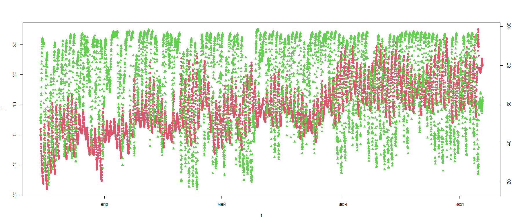
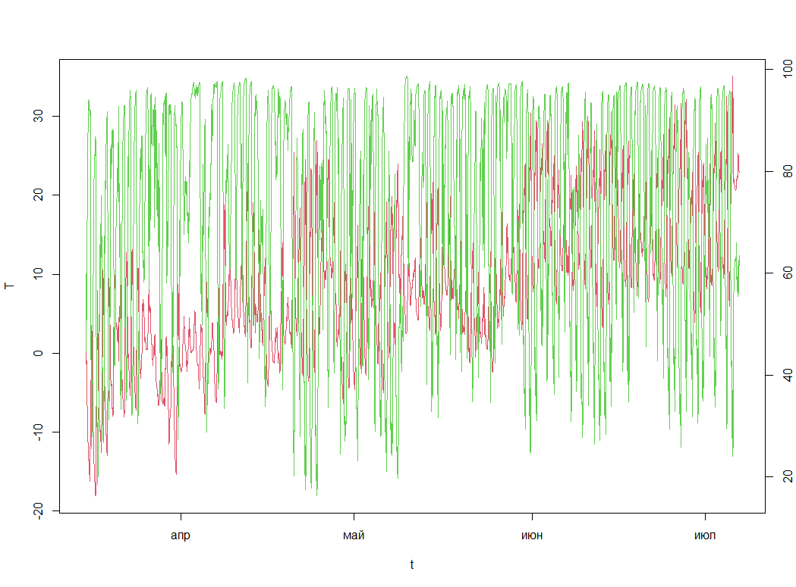

# Визуализация данных с датчика температуры Эклерк

## Импорт исходных данных

### Точечная диаграмма
```
plot_data.R
```



### Линейная диаграмма 
```
plot_data_lines.R
```


### в Spark
```
spark.R
```
Файл CSV должен быть модифицирован:

- удалить первый столбец с данными об устройстве
- разделитель запятая
- в заголовке только имена переменных без размерностей

Метод
```
spark_read_csv(sc,name="chernorechie_vozd_do_5_iyulya_2022", path="C:\\Users\\IlyaYukhnovskiy\\Documents\\chernorechie_vozd_do_5_iyulya_2022.csv")
```
дает ошибку
```
Error in as.symbol(x) : attempt to use zero-length variable name
```

## Запрос данных
```
process.R
SQL.R
```

## Моделирование
В примере используем ```ml_linear_regression()``` - модель линейной регрессии.
Предскажем расход топлива автомобиля (```mpg```) на основе его веса (```wt```) и количества цилиндров в двигателе (```cyl```)
```
model.R
```
На данных Черноречья предсказания неудовлетворительные
```
model_ch.R
```